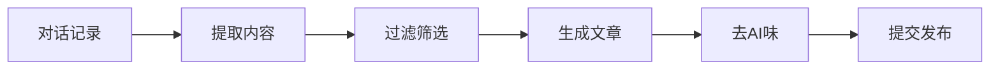

## 需求

每周做了不少技术工作，但懒得整理成博客。能不能让 AI Agent 自动从对话记录里提取有价值的内容，生成博客文章？

## 设计思路

### 核心流程



### 技能结构

```
conversation-to-blog/
├── SKILL.md                    # 技能文档
├── scripts/
│   ├── extract_conversations.py    # 提取对话
│   └── create_blog_post.py         # 生成文章
└── references/
    └── filtering-guidelines.md     # 筛选规则
```

## 实现步骤

### 1. 提取对话记录

从 `~/.openclaw/workspace/memory/` 读取最近的对话：

```python
import os
from datetime import datetime, timedelta

def extract_recent_conversations(days=7):
    memory_dir = os.path.expanduser("~/.openclaw/workspace/memory")
    cutoff = datetime.now() - timedelta(days=days)
    
    conversations = []
    for file in os.listdir(memory_dir):
        if file.endswith('.md'):
            date_str = file.split('.')[0]
            file_date = datetime.strptime(date_str, '%Y-%m-%d')
            if file_date >= cutoff:
                with open(os.path.join(memory_dir, file)) as f:
                    conversations.append(f.read())
    
    return conversations
```

### 2. 内容筛选

设置优先级规则：

**高优先级**：
- OpenClaw 技能开发
- Vibe coding（Claude Code、AWS Code）
- AI Agent 自动化
- 工具集成

**中优先级**：
- API 自动化
- DevOps 工具
- 智能家居

**低优先级**：
- 通用配置
- 语言特性

### 3. 生成文章

使用 Hexo frontmatter 格式：

```python
def create_blog_post(title, content, tags):
    frontmatter = f"""---
title: {title}
date: {datetime.now().strftime('%Y-%m-%d %H:%M:%S')}
categories: 技术
tags: {tags}
---

{content}
"""
    return frontmatter
```

### 4. 去AI味

关键步骤！用 `humanize-zh` 技能处理：

- 删除"首先、其次、最后"
- 改成口语化表达
- 打破完美结构
- 加入个人色彩

### 5. 自动提交

```bash
cd /tmp/ssttkkl-blog
git add source/_posts/*.md
git commit -m "Add blog posts"
git push origin main
```

## 实战效果

第一次运行，从一周对话中提取了 6 篇博客：

1. 米家 Skill 开发踩坑
2. Docker 代理配置
3. Playwright 剪贴板拦截
4. AI Agent 自我改进
5. uv 包管理器
6. NoneBot2 插件转换

全程自动化，只需要说"从最近的对话生成博客文章"。

## 关键点

### 敏感信息过滤

自动替换：
- 设备 ID → 通用描述
- API Key → `<API_KEY>`
- 个人信息 → "用户"

### 内容质量

只选择：
- 有完整解决方案的
- 可复用的技术模式
- 有学习价值的踩坑经历

跳过：
- 闲聊
- 未完成的任务
- 纯管理性对话

## 技能配置

在 `SKILL.md` 中定义触发词：

```markdown
Use when:
- 用户说"从对话生成博客"
- "总结最近的技术工作"
- "发布博客文章"
```

## 后续优化

1. **自动分类** - 根据内容自动选择 categories
2. **预览模式** - 提交前让用户确认
3. **定期触发** - 通过 Cron 每周自动生成 ✅

### 定时任务配置

使用 OpenClaw Cron 实现每周自动发布：

```bash
openclaw cron add \
  --name "weekly-blog-generation" \
  --description "每周自动从对话生成博客文章" \
  --cron "0 10 * * 1" \
  --announce \
  --channel qqbot \
  --to "user:01F92D453188CECB1EA2EA916F286C58" \
  --account default \
  --message "从最近7天的对话记录中提取有价值的技术内容，生成博客文章并发布到 ssttkkl-blog 仓库。重点关注 OpenClaw 技能开发、AI 自动化、vibe coding 等高优先级主题。使用 conversation-to-blog 技能完成任务。"
```

**配置说明**：
- 每周一上午 10:00 执行
- 自动提取最近 7 天对话
- 优先处理高价值主题
- 完成后通过 QQ 通知

现在完全自动化了，每周一早上醒来就能看到新发布的博客。

## 总结

这个技能把"写博客"变成了"说话"。AI Agent 自动完成：
- 提取对话
- 筛选内容
- 生成文章
- 去AI味
- 发布

现在每周的技术积累都能自动变成博客文章了。

## 参考

- [conversation-to-blog skill](https://github.com/yourusername/conversation-to-blog)
- [humanize-zh skill](https://clawhub.com/skills/humanize-zh)
- Blog: https://ssttkkl.github.io/ssttkkl-blog/
