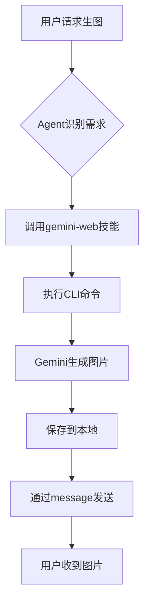

## 需求

想让 AI Agent 能生图，但官方 API 要么收费要么有限制。Gemini Web 版可以免费用 Imagen 3，能不能通过 OpenClaw 直接调用？

## 方案

基于开源库 [gemini-webapi](https://github.com/HanaokaYuzu/Gemini-API)，开发 `gemini-web` 技能，封装 CLI 工具让 OpenClaw 能直接调用。

## 逆向工程原理

### 1. Cookie 认证机制

Gemini Web 使用 Google 账号的 Cookie 进行认证：

**关键 Cookie**：
- `__Secure-1PSID` - 主认证 Cookie
- `__Secure-1PSIDTS` - 时间戳 Cookie（部分账号需要）

**自动获取**：

```python
import browser_cookie3

# 从 Chrome 读取 Cookie
cj = browser_cookie3.chrome(domain_name='google.com')
cookies = list(cj)

psid = [c for c in cookies if c.name == '__Secure-1PSID'][0].value
psidts = [c for c in cookies if c.name == '__Secure-1PSIDTS'][0].value
```

### 2. HTTP/2 通信

Gemini Web 使用 HTTP/2 协议：

```python
from httpx import AsyncClient

client = AsyncClient(
    http2=True,  # 启用 HTTP/2
    timeout=timeout,
    proxy=proxy,
    follow_redirects=True,
    headers=Headers.GEMINI.value,
    cookies=valid_cookies
)
```

### 3. gRPC-Web 协议

Gemini 使用 gRPC-Web 进行通信，数据格式为 Protocol Buffers。

**请求结构**：

```python
# RPC 请求数据
rpc_data = [
    [prompt],           # 用户输入
    None,
    [conversation_id],  # 会话 ID
    model_name,         # 模型名称
    # ... 其他参数
]

# 序列化为 JSON
payload = json.dumps(rpc_data)
```

**响应解析**：

```python
# 响应是流式的，每个 chunk 包含一个 JSON 数组
for line in response.iter_lines():
    if line.startswith(b'['):
        data = json.loads(line)
        # 解析嵌套数据结构
        text = get_nested_value(data, [0, 2])
        images = get_nested_value(data, [12, 7, 0])
```

### 4. 图像生成解析

生成的图片 URL 藏在响应的深层嵌套结构中：

```python
# 从响应中提取图片
generated_images = []
gen_img_list = get_nested_value(candidate_data, [12, 7, 0], [])

for gen_img_data in gen_img_list:
    url = get_nested_value(gen_img_data, [0, 3, 3])
    if url:
        img_num = get_nested_value(gen_img_data, [3, 6])
        generated_images.append(
            GeneratedImage(
                url=url,
                title=f"[Generated Image {img_num}]",
                alt=get_nested_value(gen_img_data, [3, 5, 0], ""),
                proxy=proxy,
                cookies=cookies
            )
        )
```

**关键点**：
- 图片 URL 在 `[12, 7, 0, i, 0, 3, 3]` 路径
- 需要保持 Cookie 才能下载图片
- 支持代理下载

### 5. Cookie 自动刷新

```python
async def start_auto_refresh(self):
    """定期刷新 Cookie"""
    while self._running:
        await asyncio.sleep(self.refresh_interval)
        try:
            # 从浏览器重新读取
            new_cookies = get_cookies_from_browser()
            if new_cookies:
                self.cookies = new_cookies
        except Exception as e:
            logger.error(f"Cookie refresh failed: {e}")
```

## CLI 工具实现

### pyproject.toml

```toml
[project]
name = "gemini-web"
version = "1.0.0"
dependencies = [
    "gemini-webapi>=2.4.0",
    "browser-cookie3>=0.19.1",
    "httpx[http2]>=0.27.0"
]

[project.scripts]
gemini-web = "gemini_webapi.cli:main"
```

### 核心依赖

- **gemini-webapi** - 逆向 Gemini Web 的 Python 库
- **browser-cookie3** - 从浏览器读取 Cookie
- **httpx[http2]** - HTTP/2 客户端

### 使用方式

```bash
cd ~/.openclaw/workspace/skills/gemini-web

# 生成图片
uv run gemini-web generate "画一只雪中独狼" \
  --image-output ~/images/

# 文本对话
uv run gemini-web generate "解释量子计算"

# 文件分析
uv run gemini-web generate "描述这张图片" --file photo.jpg
```

## OpenClaw 集成

直接对 AI Agent 说：

```
"生成图片：赛博朋克城市夜景"
```

### 执行流程



## 技术细节

### 会话管理

```python
class GeminiClient:
    def __init__(self):
        self.session_id = str(uuid.uuid4())
        self.conversation_id = None
    
    async def generate(self, prompt):
        # 构造 RPC 请求
        rpc_data = [
            [prompt],
            None,
            [self.conversation_id] if self.conversation_id else [],
            "gemini-3.0-pro"
        ]
        
        # 发送请求
        response = await self.client.post(
            Endpoint.GENERATE.value,
            json=rpc_data
        )
        
        # 解析流式响应
        async for chunk in response.aiter_lines():
            yield parse_chunk(chunk)
```

### 错误处理

```python
try:
    result = await client.generate(prompt)
except AuthError:
    # Cookie 过期，刷新
    await client.refresh_cookies()
    result = await client.generate(prompt)
except TimeoutError:
    # 超时重试
    await client.reset_connection()
    result = await client.generate(prompt)
```

## 效果

- 速度：约 60 秒/张
- 质量：Imagen 3 水平
- 成本：完全免费
- 模型：支持 Gemini 3.0 系列

## 注意

1. 需要先在 Chrome 登录 Gemini
2. 建议用隐私模式获取 Cookie
3. Cookie 自动刷新，但偶尔需要重新登录
4. 仅供个人学习使用

## 总结

通过逆向 Gemini Web 的 gRPC-Web 协议，实现了免费调用 Gemini 生图和对话。关键技术：
- Cookie 认证
- HTTP/2 通信
- gRPC-Web 协议解析
- 嵌套数据结构提取

配合 OpenClaw，现在可以直接对话生成图片。

## 参考

- [gemini-web skill](https://clawhub.com/skills/gemini-web)
- [gemini-webapi](https://github.com/HanaokaYuzu/Gemini-API) - 开源逆向库
- Gemini: https://gemini.google.com/
- gRPC-Web 协议文档
