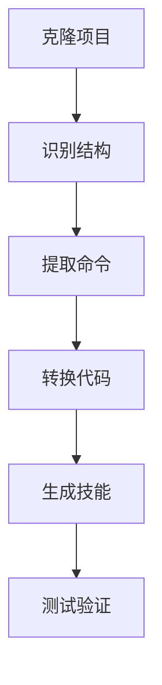

## 背景

NoneBot2 插件只能在机器人框架里跑，想提取成独立 CLI 工具需要系统化的转换方法。

## 方案

开发 `nonebot-plugin-to-skill` 技能，提供完整的转换指南，包含所有 NoneBot2 模式的转换规则。

### 转换流程



## 核心内容

### 1. 项目识别

使用 grep 检测 NoneBot2 特征：

```bash
# 检查依赖
grep -E "nonebot2|nonebot-adapter" requirements.txt pyproject.toml

# 查找命令处理器
grep -r "on_command\|on_message\|on_regex" --include="*.py" -l

# 列出源文件
find . -name "*.py" -type f | grep -E "(plugin|command|bot)"
```

### 2. 转换模式库

技能提供完整的转换规则：

**Pattern 1: on_command**

```python
# 原代码
cmd = on_command("ping")

@cmd.handle()
async def handle_ping(args: Message = CommandArg()):
    await cmd.finish(f"Pong! {args.extract_plain_text()}")
```

```python
# 转换后
import argparse
import asyncio

async def ping(message=None):
    print(f"Pong! {message}")

def main():
    parser = argparse.ArgumentParser()
    parser.add_argument("message", nargs="?")
    args = parser.parse_args()
    asyncio.run(ping(args.message))
```

**转换规则**：
- `CommandArg()` → `parser.add_argument()`
- `await matcher.finish()` → `print()`
- `aliases` → 文档说明，不创建多个文件

**Pattern 2: on_regex**

```python
# 原代码
matcher = on_regex(r"pattern (?P<name>\w+)")

@matcher.handle()
async def handle_match():
    await matcher.finish("Matched!")
```

```python
# 转换后
import re

async def regex_handler(text: str):
    match = re.search(r"pattern (?P<name>\w+)", text)
    if match:
        print("Matched!")
    else:
        print("No match")
```

**Pattern 3: on_message**

```python
# 原代码
matcher = on_message(rule=keyword("keyword"))

@matcher.handle()
async def handle_msg():
    await matcher.finish("Reply")
```

```python
# 转换后
async def message_handler(text: str):
    if "keyword" in text:
        print("Reply")
```

### 3. 转换规则表

| NoneBot2 | CLI |
|----------|-----|
| `CommandArg()` | `parser.add_argument()` |
| `await matcher.finish()` | `print()` |
| `await matcher.send()` | `print()` |
| `Event.get_user_id()` | 命令行参数 |
| `matcher.set_arg()` | 本地变量 |

### 4. 包管理

技能要求必须使用包管理器（uv/pdm/poetry）：

```toml
[project]
name = "skill-name"
dependencies = ["httpx>=0.24.0"]

[project.scripts]
cmd1 = "scripts.cmd1:main"
```

### 5. 保留异步

关键原则：不改 async/await，只包装入口

```python
# 保留原有异步函数
async def handler():
    result = await api_call()
    return result

# 添加同步入口
def main():
    asyncio.run(handler())
```

## 实战案例

技能文档包含完整的雀魂插件转换案例：

**原项目**：`nonebot-plugin-majsoul`

**命令提取**：
- `majsoul_info` (4人麻将)
- `majsoul_3p_info` (3人麻将)
- `majsoul_pt_plot` (PT走势)

**转换结果**：
```
majsoul-cli/
├── SKILL.md
├── scripts/
│   ├── majsoul-info.py
│   └── majsoul-pt.py
└── pyproject.toml
```

## 技能价值

1. **完整模式库**：覆盖所有 NoneBot2 命令类型
2. **详细示例**：每个模式都有转换前后对比
3. **最佳实践**：包管理、异步保留、错误处理
4. **实战案例**：真实项目转换全流程

## 总结

这个技能是一份详尽的转换指南，不是自动化工具。通过：
- grep 快速定位
- 模式库对照转换
- 保留异步结构
- 标准化技能结构

提供了系统化的 NoneBot2 到 OpenClaw 转换方法。

## 参考

- [nonebot-plugin-to-skill](https://github.com/yourusername/nonebot-plugin-to-skill)
- [NoneBot2 文档](https://nonebot.dev/docs/advanced/matcher)
- [nonebot-plugin-majsoul](https://github.com/ssttkkl/nonebot-plugin-majsoul)
