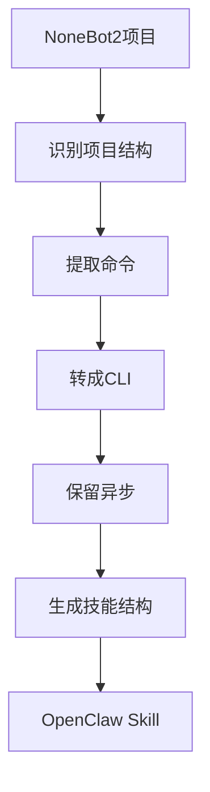

## 需求

NoneBot2 插件只能在机器人框架里跑，想提取成独立 CLI 工具很麻烦。手动转换要改一堆代码，容易出错。能不能自动化？

## 方案

开发 `nonebot-plugin-to-skill` 技能，自动完成转换。

### 转换流程



## 技能实现

### 1. 项目识别

自动检测 NoneBot2 项目：

```python
def is_nonebot_project(path):
    # 检查 pyproject.toml
    if os.path.exists(f"{path}/pyproject.toml"):
        with open(f"{path}/pyproject.toml") as f:
            content = f.read()
            if "nonebot2" in content:
                return True
    
    # 检查 Python 文件
    for file in glob.glob(f"{path}/**/*.py", recursive=True):
        with open(file) as f:
            if "from nonebot import" in f.read():
                return True
    
    return False
```

### 2. 命令提取

解析 AST 提取命令处理器：

```python
import ast

def extract_commands(file_path):
    with open(file_path) as f:
        tree = ast.parse(f.read())
    
    commands = []
    for node in ast.walk(tree):
        # 查找 on_command 调用
        if isinstance(node, ast.Call):
            if hasattr(node.func, 'id') and node.func.id == 'on_command':
                cmd_name = node.args[0].s
                # 查找对应的 handler
                handler = find_handler(tree, cmd_name)
                commands.append({
                    'name': cmd_name,
                    'handler': handler
                })
    
    return commands
```

### 3. CLI 生成

自动生成 CLI 脚本：

```python
def generate_cli_script(command):
    template = '''
import argparse
import asyncio

async def {func_name}({params}):
    {body}

def main():
    parser = argparse.ArgumentParser()
    {arg_definitions}
    args = parser.parse_args()
    asyncio.run({func_name}({call_args}))

if __name__ == "__main__":
    main()
'''
    
    return template.format(
        func_name=command['name'],
        params=extract_params(command['handler']),
        body=transform_body(command['handler']),
        arg_definitions=generate_argparse(command['handler']),
        call_args=generate_call_args(command['handler'])
    )
```

### 4. 代码转换

关键转换规则：

```python
def transform_body(handler_ast):
    """转换 handler 函数体"""
    transformer = NoneBot2Transformer()
    new_ast = transformer.visit(handler_ast)
    return ast.unparse(new_ast)

class NoneBot2Transformer(ast.NodeTransformer):
    def visit_Call(self, node):
        # await matcher.finish() → print()
        if self.is_matcher_finish(node):
            return ast.Call(
                func=ast.Name(id='print'),
                args=node.args,
                keywords=[]
            )
        
        # await matcher.send() → print()
        if self.is_matcher_send(node):
            return ast.Call(
                func=ast.Name(id='print'),
                args=node.args,
                keywords=[]
            )
        
        return node
```

### 5. 技能结构生成

自动创建完整技能目录：

```python
def generate_skill_structure(project_name, commands):
    skill_dir = f"~/.openclaw/workspace/skills/{project_name}"
    
    # 创建目录结构
    os.makedirs(f"{skill_dir}/scripts", exist_ok=True)
    os.makedirs(f"{skill_dir}/src", exist_ok=True)
    
    # 生成 SKILL.md
    with open(f"{skill_dir}/SKILL.md", "w") as f:
        f.write(generate_skill_md(project_name, commands))
    
    # 生成 CLI 脚本
    for cmd in commands:
        script_path = f"{skill_dir}/scripts/{cmd['name']}.py"
        with open(script_path, "w") as f:
            f.write(generate_cli_script(cmd))
    
    # 生成 pyproject.toml
    with open(f"{skill_dir}/pyproject.toml", "w") as f:
        f.write(generate_pyproject(project_name, commands))
```

## 实战案例

转换雀魂查询插件：

```bash
# 克隆项目
git clone https://github.com/ssttkkl/nonebot-plugin-majsoul

# 自动转换
openclaw skill convert nonebot-plugin-majsoul
```

**自动生成**：
- `scripts/majsoul-info.py` - 4人麻将查询
- `scripts/majsoul-3p-info.py` - 3人麻将查询
- `scripts/majsoul-pt.py` - PT走势图
- `SKILL.md` - 完整文档
- `pyproject.toml` - 依赖配置

**原来**：手动转换需要几小时
**现在**：自动完成，几分钟

## 关键技术

### AST 解析

使用 Python AST 模块解析代码结构：

```python
import ast

tree = ast.parse(source_code)
for node in ast.walk(tree):
    if isinstance(node, ast.FunctionDef):
        # 分析函数定义
        analyze_function(node)
```

### 代码转换

使用 `ast.NodeTransformer` 转换代码：

```python
class Transformer(ast.NodeTransformer):
    def visit_Await(self, node):
        # 处理 await 表达式
        return self.transform_await(node)
```

### 保留异步

不改变 async/await 结构，只包装入口：

```python
# 保留原有异步函数
async def handler():
    result = await api_call()
    return result

# 添加同步入口
def main():
    asyncio.run(handler())
```

## 技能配置

在 `SKILL.md` 中定义：

```markdown
---
name: nonebot-plugin-to-skill
description: Convert NoneBot2 plugins to OpenClaw skills
---

Use when:
- 用户说"转换 NoneBot2 插件"
- "把这个插件改成 skill"
```

## 效果

- 自动识别项目结构
- 提取所有命令
- 生成 CLI 脚本
- 保留异步代码
- 创建完整技能

## 总结

通过 AST 解析和代码转换，实现了 NoneBot2 插件到 OpenClaw Skill 的自动化转换。关键技术：
- AST 解析提取命令
- NodeTransformer 转换代码
- 保留异步结构
- 自动生成技能结构

现在转换插件只需要一条命令。

## 参考

- [nonebot-plugin-to-skill](https://github.com/yourusername/nonebot-plugin-to-skill)
- Python AST 文档
- [nonebot-plugin-majsoul](https://github.com/ssttkkl/nonebot-plugin-majsoul) - 转换案例
