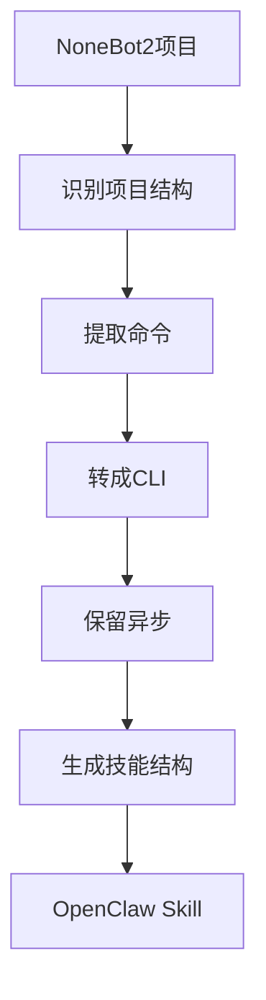

## 需求

NoneBot2 插件只能在机器人框架里跑，想提取成独立 CLI 工具很麻烦。需要一个系统化的转换方法。

## 方案

开发 `nonebot-plugin-to-skill` 技能，提供完整的转换指南和模式库。

### 转换流程



## 技能实现

### 1. 项目识别

使用 grep 检测 NoneBot2 项目：

```bash
# 检查依赖
grep -E "nonebot2|nonebot-adapter" requirements.txt pyproject.toml

# 查找命令处理器
grep -r "on_command\|on_message\|on_regex" --include="*.py" -l

# 列出主要文件
find . -name "*.py" -type f | grep -E "(plugin|command|bot)"
```

### 2. 命令提取

手动分析命令模式：

**Pattern 1: on_command**

```python
# 原代码
from nonebot import on_command
from nonebot.params import CommandArg

ping = on_command("ping")

@ping.handle()
async def handle_ping(args: Message = CommandArg()):
    msg = args.extract_plain_text()
    await ping.finish(f"Pong! {msg}")
```

**转换规则**：
- `on_command("name")` → CLI 脚本名称
- `CommandArg()` → `argparse.add_argument()`
- `await matcher.finish()` → `print()`

### 3. CLI 生成模板

提供标准转换模板：

```python
import argparse
import asyncio

async def {command_name}({params}):
    """转换后的命令处理函数"""
    # 保留原有业务逻辑
    result = await original_logic()
    print(result)

def main():
    parser = argparse.ArgumentParser()
    parser.add_argument("arg1", help="参数说明")
    args = parser.parse_args()
    asyncio.run({command_name}(args.arg1))

if __name__ == "__main__":
    main()
```

### 4. 转换规则库

技能提供完整的转换规则：

| NoneBot2 | CLI 等价 |
|----------|---------|
| `CommandArg()` | `parser.add_argument()` |
| `await matcher.finish()` | `print()` |
| `await matcher.send()` | `print()` |
| `Event.get_user_id()` | 命令行参数 |
| `on_command("name", aliases={...})` | 主命令名 + 文档说明别名 |

### 5. 包管理配置

自动生成 pyproject.toml：

```toml
[project]
name = "skill-name"
dependencies = [
    "httpx>=0.24.0",
    # 从原项目提取依赖
]

[project.scripts]
cmd1 = "scripts.cmd1:main"
```

## 实战案例

转换雀魂查询插件：

**原项目结构**：
```
nonebot-plugin-majsoul/
├── pyproject.toml
└── src/nonebot_plugin_majsoul/
    └── paifuya/
        ├── query_majsoul_info.py
        └── query_majsoul_records.py
```

**转换步骤**：

1. 克隆项目
2. 用 grep 找到命令：`majsoul_info`, `majsoul_3p_info`
3. 分析参数：nickname, room_rank, time_range
4. 生成 CLI 脚本
5. 创建技能结构

**生成结果**：
```
majsoul-cli/
├── SKILL.md
├── scripts/
│   ├── majsoul-info.py
│   └── majsoul-records.py
└── pyproject.toml
```

## 关键技术

### grep 模式匹配

快速定位命令处理器：

```bash
# 查找所有命令
grep -rn "on_command" --include="*.py"

# 提取命令名
grep -oP 'on_command\("\K[^"]+' *.py
```

### 手动代码分析

阅读源码理解逻辑：
1. 找到 handler 函数
2. 识别参数来源
3. 理解业务逻辑
4. 保留核心代码

### 异步保留

不改变异步结构：

```python
# 保留原有 async 函数
async def handler():
    result = await api_call()
    return result

# 只添加同步入口
def main():
    asyncio.run(handler())
```

## 效果

- 系统化转换流程
- 完整的模式库
- 标准化技能结构
- 保留异步代码

## 总结

通过 grep 模式匹配和手动代码分析，提供了 NoneBot2 插件到 OpenClaw Skill 的系统化转换方法。关键：
- grep 快速定位命令
- 转换规则库
- 标准模板
- 手动分析保证质量

虽然不是全自动，但提供了清晰的转换路径。

## 参考

- [nonebot-plugin-to-skill](https://github.com/yourusername/nonebot-plugin-to-skill)
- [NoneBot2 文档](https://nonebot.dev/)
- [nonebot-plugin-majsoul](https://github.com/ssttkkl/nonebot-plugin-majsoul) - 转换案例
