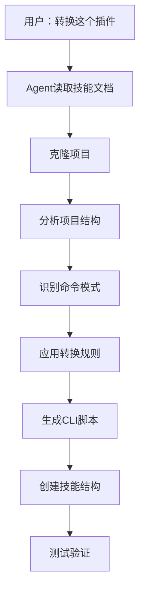

## 背景

NoneBot2 插件只能在机器人框架里跑，想提取成独立 CLI 工具。手动转换容易出错，能不能让 AI Agent 来做？

## 方案

开发 `nonebot-plugin-to-skill` 技能，让 AI Agent 按照系统化流程完成转换。

### AI Agent 工作流



## 技能设计

### 1. 为什么需要技能

AI Agent 需要：
- **系统化流程**：按步骤执行，不遗漏
- **模式库**：识别各种 NoneBot2 命令类型
- **转换规则**：知道如何改写代码
- **最佳实践**：包管理、异步保留

### 2. 技能内容

**Phase 1: 项目识别**

Agent 需要判断：
- 这是不是 NoneBot2 项目？
- 项目结构是什么样的？
- 入口文件在哪？

技能提供检测方法和典型结构。

**Phase 2: 命令提取**

Agent 需要找到：
- 有哪些命令？
- 每个命令的参数是什么？
- Handler 函数在哪？

技能提供所有 NoneBot2 命令模式（on_command、on_regex、on_message）。

**Phase 3: 代码转换**

Agent 需要知道：
- `CommandArg()` 改成什么？
- `await matcher.finish()` 改成什么？
- 异步代码怎么保留？

技能提供完整转换规则表。

**Phase 4: 技能生成**

Agent 需要创建：
- 标准目录结构
- SKILL.md 文档
- pyproject.toml 配置

技能提供模板和规范。

### 3. 转换规则示例

**on_command 转换**：

```python
# Agent 看到这个
cmd = on_command("ping")
@cmd.handle()
async def handle(args: Message = CommandArg()):
    await cmd.finish(f"Pong! {args.extract_plain_text()}")

# 技能告诉 Agent 改成这个
async def ping(message=None):
    print(f"Pong! {message}")

def main():
    parser = argparse.ArgumentParser()
    parser.add_argument("message", nargs="?")
    args = parser.parse_args()
    asyncio.run(ping(args.message))
```

**为什么这样转换**：
- 保留异步函数（避免重写业务逻辑）
- 用 argparse 替代 NoneBot2 参数系统
- print 替代消息发送（CLI 环境）
- asyncio.run 包装（标准 Python 模式）

## 实战：雀魂插件转换

用户说："转换 nonebot-plugin-majsoul"

**Agent 执行流程**：

1. **读取技能** - 加载转换规则
2. **克隆项目** - 获取源码
3. **分析结构** - 发现 4 个命令
4. **识别模式** - 都是 on_command
5. **提取逻辑** - 找到 API 调用代码
6. **生成脚本** - 创建 4 个 CLI 文件
7. **配置依赖** - 生成 pyproject.toml
8. **写文档** - 生成 SKILL.md

**结果**：
```
majsoul-cli/
├── SKILL.md
├── scripts/
│   ├── majsoul-info.py
│   ├── majsoul-3p-info.py
│   ├── majsoul-pt.py
│   └── majsoul-records.py
└── pyproject.toml
```

## 为什么这样设计

### 1. 系统化流程

AI Agent 需要明确的步骤，不能靠"猜"。技能提供：
- 检查清单
- 决策树
- 转换规则

### 2. 模式识别

NoneBot2 有多种命令类型，技能提供：
- 所有模式的示例
- 识别特征
- 转换方法

### 3. 保留核心逻辑

转换不是重写，技能强调：
- 保留异步代码
- 只改接口层
- 不动业务逻辑

### 4. 标准化输出

技能规定：
- 必须用包管理器
- 统一目录结构
- 标准文档格式

## 技能价值

不是自动化工具，是 **AI Agent 的操作手册**：
- 告诉 Agent 做什么
- 告诉 Agent 怎么做
- 告诉 Agent 为什么这样做

## 总结

`nonebot-plugin-to-skill` 是一份详尽的转换指南，让 AI Agent 能够系统化地完成 NoneBot2 到 OpenClaw 的转换。关键是提供：
- 清晰的工作流程
- 完整的模式库
- 明确的转换规则
- 标准化的输出

AI Agent 按照技能指导，就能完成复杂的代码转换任务。

## 参考

- [nonebot-plugin-to-skill](https://github.com/yourusername/nonebot-plugin-to-skill)
- [NoneBot2 文档](https://nonebot.dev/)
- [nonebot-plugin-majsoul](https://github.com/ssttkkl/nonebot-plugin-majsoul)
